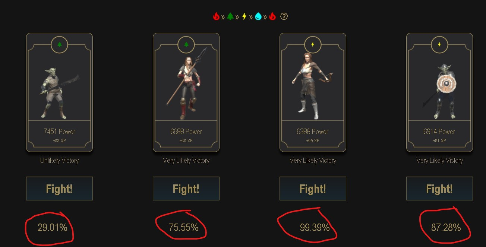
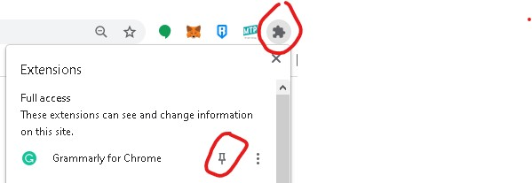

# Cryptoblade Combat Tool
Tool for cryptoblade, it will calculate combat winning probability. 
This was created purely on JS by scraping the data available on the page.
No external API calls, no need to enter your metamask details.

## How it works?

- Open cryptoblades site https://app.cryptoblades.io/
- Please register if you are still not a member.
- When you are ready! (meaning you have a character and a weapon)
- Go to combat
- Select a stamina cost
- Select a weapon
- Once, you see the enemy list
- Click the MTP icon on your chrome extension
- It should show you your combat winning probability at the bottom of the page near the FIGHT button.

## How to install?
- Get from chrome extension
    - TBD
- Manually install
    - Download the code thru Git
    - Open Chrome browser:
        - On menu -> More Tools -> Extensions
        - Select button "Load unpacked".
        - Select the directory where you download the tool.
    - Click the extension button in the browser and pin the tool.
    - 

## Recent updates
 - 8/2/2021 Submitted the tool in chrome extension web store - awaiting approval.

## Roadmap
 - Update tool to include rewards

## Contribution
Pull requests are welcome. For major changes, please open an issue first to discuss what you would like to change.

## License
[MIT](https://choosealicense.com/licenses/mit/)