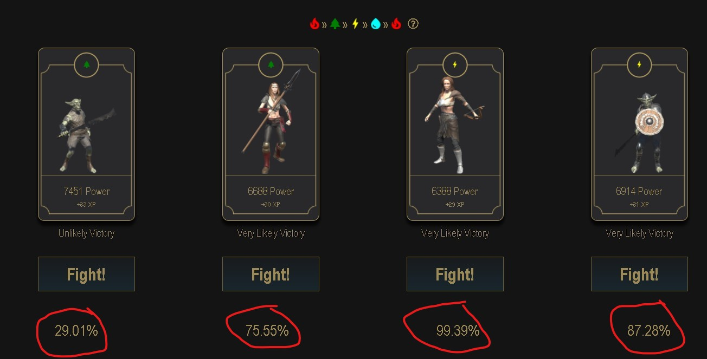
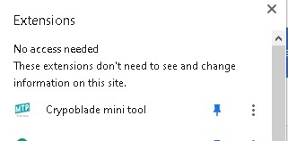

# cryptoblade-tool
Tool for cryptoblade, calculate combat probability

## How it works?

- Open cryptoblades site https://app.cryptoblades.io/
- Please register if you are still not a member.
- When you are ready! (meaning have a character and a weapon)
- Go to combat
- Select a stamina cost
- Select a weapon
- Once, you see the Enemy list
- Click the MTP icon on your chrome extension
- It should show you your combat winning probability at the bottom of the page near the FIGHT button.

## How to install?
- Get from chrome extension
    - TBD
- Manually install
    - Download the code thru Git
    - Open chrome browser:
        - On menu -> More Tools -> Extensions
        - Select button "Load unpacked".
        - Select the directory where you download the tool.
    - Click the extension button the browser and pin the tool.
    - 

## Updates

## Contribution
